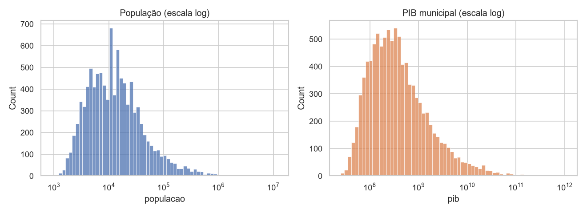
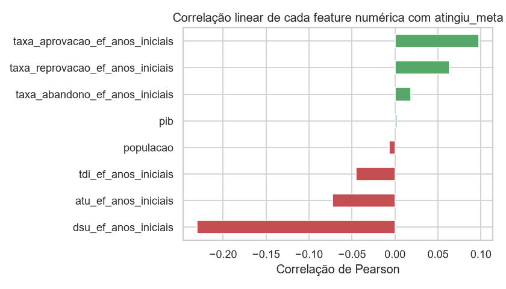
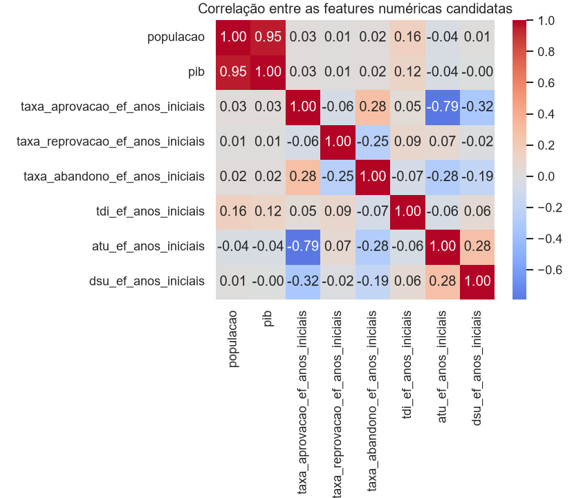
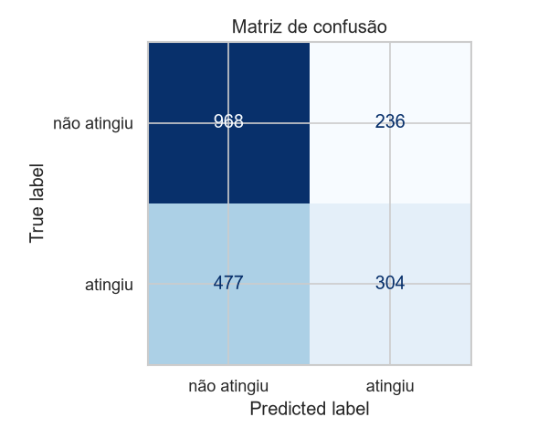
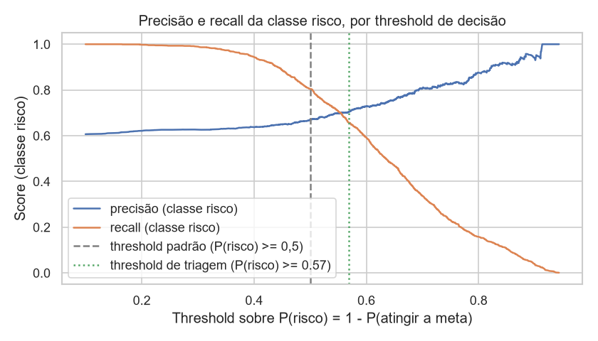
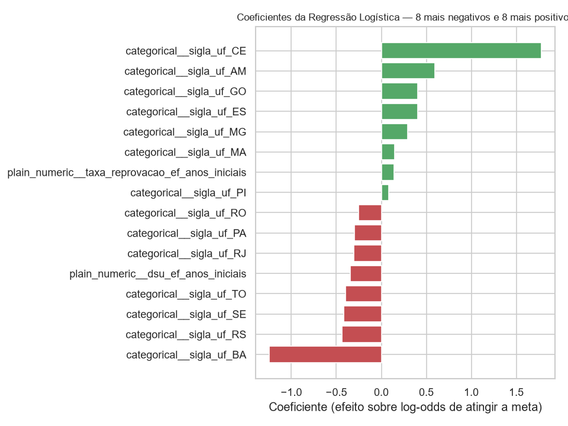
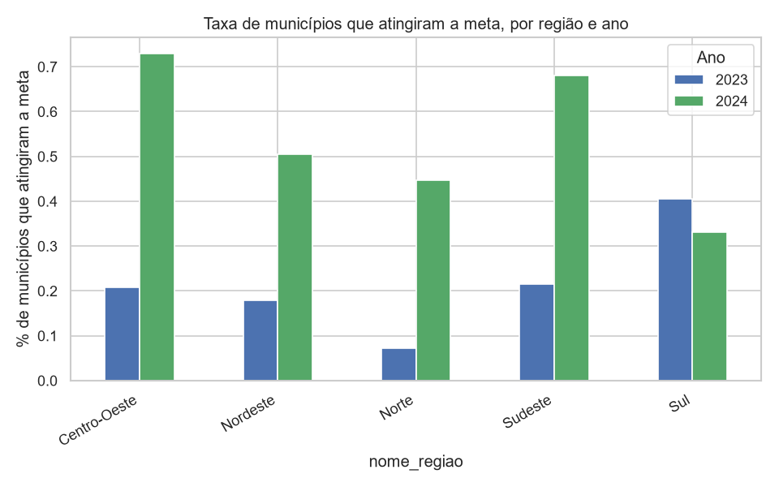
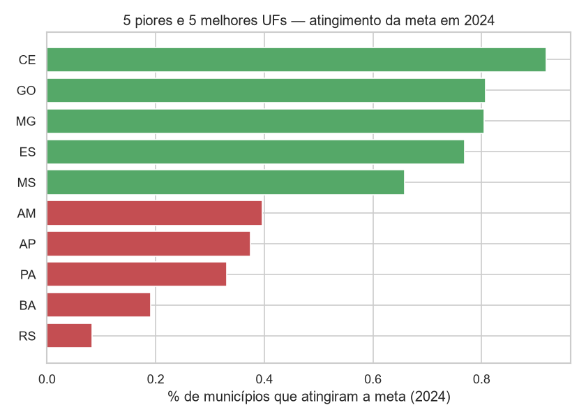
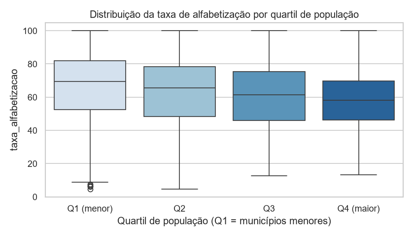

# Tech Challenge – Fase 3: Predição e Inteligência Analítica para Alfabetização no Brasil

Modelo supervisionado de classificação binária que prevê se um município brasileiro atinge ou
não a própria meta oficial de alfabetização (INEP), a partir de dados educacionais, territoriais,
populacionais e socioeconômicos.

## Estrutura do projeto

```
data/               dataset bruto (CSV) e processado (Parquet)
notebooks/          01_eda.ipynb (análise exploratória) e 02_modelagem.ipynb (pipeline de ML)
src/preprocessing/  extração e junção dos dados (BigQuery)
src/modeling/       pré-processador, modelos candidatos e treino/seleção do campeão
src/evaluation/     métricas de classificação e resumo de validação cruzada
src/visualization/  gráficos usados na EDA e na modelagem
models/             pipeline final treinado (joblib)
reports/            métricas do modelo campeão (JSON)
images/             gráficos gerados pelos notebooks
```

## Contexto do problema

A alfabetização na idade certa é uma das metas educacionais mais monitoradas no Brasil, com meta
nacional de 100% dos municípios até 2030. Gestores públicos precisam identificar, com antecedência,
quais municípios correm risco de não atingir suas metas de alfabetização, para priorizar recursos e
políticas de intervenção. Este projeto usa dados oficiais do INEP (avaliação de alfabetização, por
município) somados a variáveis territoriais, populacionais e socioeconômicas para construir um
modelo preditivo que apoie essa priorização.

Os dados de alfabetização e metas vêm da camada Silver de um projeto anterior de engenharia de
dados (BigQuery, datasets `bronze`/`silver`/`gold` sobre a avaliação de alfabetização do INEP). A
camada Gold desse projeto concentra-se em taxas e metas agregadas por UF/Brasil, sem variáveis
territoriais ou socioeconômicas — por isso este projeto usa a camada Silver (grão município × ano)
como base e a enriquece com fontes públicas externas (IBGE, INEP) via join direto por
`id_municipio`, o que é tratado com mais detalhe na seção seguinte.

## Objetivo analítico

Construir um pipeline de classificação binária que, para cada município e ano, preveja se a taxa
de alfabetização atingiu ou não a meta oficial do próprio município, e usar esse modelo (mais a
análise exploratória que o sustenta) para responder cinco perguntas de negócio:

1. Quais fatores mais impactam a alfabetização?
2. Quais municípios estão em maior risco?
3. Quais regiões apresentam padrões semelhantes entre si?
4. Como prever municípios que podem não atingir metas futuras?
5. Quais variáveis mais pesam na decisão do modelo?

As respostas a cada uma estão distribuídas ao longo das seções abaixo (principalmente em
"Interpretação dos resultados", "Insights encontrados" e "Aplicação prática").

## Descrição da base utilizada

**Unidade de análise: município × ano**, não aluno individual. A avaliação de alfabetização no
grão aluno não traz nenhuma variável territorial ou socioeconômica associada — apenas rede de
ensino, ano e município. Essas variáveis só existem de forma agregada por município, então essa é
a granularidade em que o problema pode ser respondido com sinal real de território/socioeconomia,
e é também o grão em que as cinco perguntas de negócio fazem sentido (elas falam de municípios e
regiões, não de alunos).

**Fonte principal:** taxa de alfabetização e meta oficial 2024 por município, filtradas para a
rede pública (estadual + municipal combinadas — único recorte sem duplicidade de município por
ano nos dados de origem).

**Fontes externas (join por `id_municipio`, via BigQuery público, sem download manual):**

| Fonte | O que contribui |
|---|---|
| IBGE – população municipal | indicador populacional |
| IBGE – PIB municipal | indicador socioeconômico |
| Diretório de municípios do IBGE | região, mesorregião, capital de UF, Amazônia Legal (territorial) |
| Indicadores educacionais do INEP por município | taxas de aprovação/reprovação/abandono, indicadores de infraestrutura e complexidade de gestão dos anos iniciais do Ensino Fundamental (educacional complementar) |

**Resultado da extração:** 9.921 linhas (4.689 municípios em 2023 + 5.232 em 2024), 21 colunas.
Menos de 0,2% de valores nulos, concentrados em 3 colunas educacionais — tratados por imputação de
mediana no pipeline. O PIB municipal só está disponível oficialmente até 2023 (defasagem normal de
publicação do IBGE); para as linhas de 2024 usa-se o PIB de 2023 como melhor proxy disponível, uma
limitação documentada e não um erro de junção.

**Definição do alvo (`atingiu_meta`):** `taxa_alfabetizacao >= meta_alfabetizacao_2024` no recorte
de rede pública. Essa definição foi preferida a um corte fixo (ex.: 80%, nível 5 oficial do INEP)
por dois motivos: usa uma meta oficial do INEP em vez de um limiar arbitrário, e responde
diretamente à pergunta de negócio sobre previsão de metas futuras. Municípios sem meta oficial
preenchida (~5% do total) foram descartados, não imputados — a meta é a base do próprio alvo, e
imputá-la equivaleria a fabricar o rótulo do modelo.

⚠️ **Vazamento de dado identificado e tratado:** as colunas `taxa_alfabetizacao`,
`media_portugues` e `meta_alfabetizacao_2024` permanecem no dataset apenas para referência e para
reconstrução do alvo — nunca entram como *features* do modelo. `meta_alfabetizacao_2024` define o
próprio alvo por construção, e `media_portugues` tem correlação de 0,93 com `taxa_alfabetizacao`
(mesmo processo de avaliação que originou o alvo).




## Etapas de modelagem

1. **Extração** dos dados via BigQuery (`src/preprocessing/extract_data.py`), unindo a base de
   alfabetização com as quatro fontes externas por `id_municipio`, salva em `data/raw` (CSV) e
   `data/processed` (Parquet).
2. **Análise exploratória** (`notebooks/01_eda.ipynb`): distribuição do alvo, nulos, correlações
   entre features e alvo, assimetria de população/PIB, padrões regionais, e uma seção adicional de
   achados abertos (multicolinearidade, segmentação por quartil de população, inconsistência nas
   taxas educacionais) — documentados como hipóteses quando não há evidência suficiente para uma
   conclusão fechada.
3. **Pré-processamento** (`src/modeling/pipeline.py`), integrado ao objeto do modelo via
   `Pipeline`/`ColumnTransformer` do scikit-learn:
   - Imputação por mediana (numéricas) e por moda (categóricas).
   - `log1p` + padronização para `população` e `PIB` (fortemente assimétricos).
   - Padronização simples para os 6 indicadores educacionais e as flags binárias
     (`capital_uf`, `amazonia_legal`).
   - `OneHotEncoder` para a UF (`sigla_uf`).
   - Exclusão explícita de `ano` do conjunto de features (só 2 valores observados; usá-lo faria o
     modelo aprender o "efeito do ano" em vez de um padrão estrutural que generalize).
4. **Comparação de modelos** (`src/modeling/train_model.py`): Regressão Logística, Random Forest e
   Gradient Boosting, avaliados por `StratifiedKFold` (5 dobras) com ROC-AUC.
5. **Otimização de hiperparâmetros** do modelo campeão via `RandomizedSearchCV` (20 iterações,
   mesmo esquema de validação cruzada).
6. **Validação final** em duas frentes: holdout estratificado (20%, nunca visto no treino/tuning) e
   validação temporal (treina em 2023, testa em 2024) para medir generalização real ano a ano.
7. **Interpretabilidade**: coeficientes do modelo linear e SHAP, comparados entre si.




## Escolha do algoritmo

Três candidatos foram comparados por validação cruzada (ROC-AUC médio, 5 dobras):

| Modelo | ROC-AUC médio (CV) |
|---|---|
| **Regressão Logística** | **0,6956** |
| Gradient Boosting | 0,6891 |
| Random Forest | 0,6575 |
| Regressão Logística (após tuning, `C=0,1`) | 0,6960 |

A Regressão Logística venceu, contrariando a expectativa inicial da análise exploratória, que
sugeria maior peso a modelos baseados em árvore por causa das correlações lineares individuais
fracas (máximo |r| ≈ 0,23). Na prática, a Regressão Logística generalizou melhor por validação
cruzada — o achado é reportado como está, sem forçar uma explicação que os dados não sustentam.


## Métricas de avaliação

ROC-AUC foi a métrica principal de seleção e comparação, por não depender de um limiar fixo de
decisão e por ser adequada a um problema de classificação com desbalanceamento moderado.

**Holdout de teste (20%, nunca visto no treino/tuning):**

| Métrica | Valor |
|---|---|
| ROC-AUC | 0,6745 |
| Acurácia | 0,6408 |
| Precisão | 0,5630 |
| Recall | 0,3892 |
| F1 | 0,4603 |

No limiar padrão (0,5) o recall é baixo. Ajustando o limiar de decisão para ≈0,38, o recall sobe
para ≈0,70 mantendo precisão ≈0,50 — ponto de operação recomendado para uso como ferramenta de
triagem de política pública, em que é preferível investigar um município a mais do que deixar
passar um que precisava de atenção.

**Validação temporal (treina em 2023, testa em 2024):**

| Métrica | Valor |
|---|---|
| ROC-AUC | 0,5535 |
| Acurácia | 0,4641 |
| Precisão | 0,5131 |
| Recall | 0,0902 |
| F1 | 0,1534 |

A queda acentuada de desempenho é o achado mais importante da validação: entre 2023 e 2024 houve
uma melhora real e generalizada na taxa de alfabetização (ver "Insights"), deslocando o patamar
nacional inteiro. Um modelo treinado apenas no patamar de 2023 não tem nenhuma feature que capture
esse tipo de mudança de contexto de um ano para o outro — implicação discutida em "Limitações".





## Interpretação dos resultados

Coeficientes da Regressão Logística e valores SHAP convergem para o mesmo padrão: **o sinal mais
forte é geográfico**. Bahia (coeficiente -1,24), Sergipe e Tocantins têm efeito negativo forte;
Ceará (coeficiente +1,78) tem efeito positivo forte — compatível com o desempenho já conhecido do
Ceará em avaliações educacionais nacionais.

Fora do bloco geográfico, a variável de maior impacto médio no SHAP é `dsu_ef_anos_iniciais`
(percentual de docentes com curso superior nos anos iniciais do Ensino Fundamental), com efeito
**negativo** sobre a probabilidade de atingir a meta — um padrão contraintuitivo já identificado na
análise exploratória (correlação negativa em todas as 5 regiões do país, portanto não é
confundimento regional) e que se confirma dentro do modelo treinado, mas sem uma explicação causal
identificada nos dados disponíveis. Fica registrado como achado a investigar, não como conclusão.




## Insights encontrados

- **A melhora de 2023 para 2024 é real, não um efeito de meta mais fácil.** A meta média
  praticamente não mudou (61,97 → 62,15), mas a taxa de alfabetização real subiu (60,59 → 63,52) —
  o percentual de municípios que atingiram a própria meta saltou de 23,2% para 53,8%.
- **Geografia domina o resultado.** O Sul foi a única região que piorou entre os dois anos
  (41% → 33% de municípios na meta); dentro dela, o Rio Grande do Sul caiu para 8,3% em 2024 (ante
  53,8% de média nacional). Isso coincide no tempo com as enchentes de abril-maio de 2024 no
  estado, que afetaram fortemente a rede escolar — uma hipótese plausível, mas não comprovável com
  as variáveis estáticas disponíveis neste dataset (um choque exógeno pontual, não um padrão
  estrutural). Registrado como limitação, não como conclusão fechada.
- **Capital de UF e Amazônia Legal têm sinal mais fraco, porém consistente**: municípios que são
  capital atingem a meta com menos frequência (28,6% vs. 39,4%), assim como municípios da Amazônia
  Legal (31,2% vs. 40,7%) — compatível com desigualdades educacionais regionais já conhecidas.
- **População e PIB têm forte multicolinearidade entre si** (correlação 0,95) e correlação
  individual próxima de zero com o alvo — mantidos como features (modelos de árvore toleram
  colinearidade), mas candidatos a remoção em uma versão futura mais enxuta do modelo.
- **Segmento de baixo custo e alto impacto para política pública**: dos 6.018 municípios que não
  atingiram a meta em 2024, 1.225 (20,4%) estavam a menos de 2 pontos percentuais dela — o grupo
  mais barato de "empurrar" para o resultado desejado.
- **Hipóteses em aberto, sem conclusão fechada** (documentadas assim de propósito, para não
  extrapolar além do que os dados sustentam): municípios menores (1º quartil de população) têm
  taxa de alfabetização com maior variabilidade e média mais alta que os maiores (4º quartil),
  possivelmente por efeito de amostra pequena na avaliação; e as taxas de aprovação, reprovação e
  abandono do INEP não somam ~100% (média 122,75%, variando de 19,8% a 189,3%), sem uma explicação
  metodológica identificada — mantidas como features mesmo assim, por não haver indício de erro na
  extração.





## Limitações do projeto

- **Dataset pequeno para o grão escolhido**: 9.921 linhas cobrindo apenas 2 anos (2023-2024).
  Suficiente para validação cruzada e um holdout estratificado, mas insuficiente para capturar
  padrões que só emergem com mais séries anuais.
- **Validação temporal expõe a principal fragilidade do modelo**: ao treinar apenas com 2023 e
  testar em 2024, o ROC-AUC cai para 0,55 (quase aleatório) e o recall despenca para 0,09. O
  modelo serve para ranquear risco relativo *dentro do mesmo ciclo de avaliação*, não para prever
  o patamar nacional de um ano futuro sem recalibração — isso deveria ser feito anualmente, à
  medida que novos dados de avaliação ficam disponíveis.
- **PIB defasado**: a base pública mais recente de PIB municipal só cobre até 2023; as linhas de
  2024 usam o valor de 2023 como proxy, uma limitação normal da fonte, não um erro de extração.
- **Possível choque exógeno não capturado**: a queda de desempenho no Rio Grande do Sul em 2024
  coincide com as enchentes de abril-maio daquele ano, mas o dataset não tem nenhuma variável que
  represente eventos climáticos/desastres — o modelo não tem como aprender esse tipo de efeito.
- **Pergunta de negócio "regiões com padrões semelhantes" respondida apenas de forma qualitativa**
  (via coeficientes do modelo e análise regional da EDA), sem uma etapa formal de clusterização —
  ver "Evoluções futuras".
- **Poder explicativo moderado**: ROC-AUC de 0,67 no holdout indica sinal real, mas longe de um
  modelo determinístico — esperado dado que fatores não capturados nos dados disponíveis (gestão
  escolar local, eventos pontuais, qualidade pedagógica) seguem influenciando o resultado.

## Aplicação prática para políticas públicas

- **Ferramenta de triagem, não de decisão automática**: usando o limiar de decisão ajustado
  (≈0,38 em vez do padrão 0,5), o modelo identifica ≈70% dos municípios que de fato não atingirão
  a meta, ao custo de também sinalizar alguns que atingiriam — um trade-off adequado para
  priorização de visitas técnicas e recursos, em que o custo de investigar um município extra é
  bem menor que o de ignorar um em risco real.
- **Priorização geográfica objetiva**: o peso forte de UF nos coeficientes e no SHAP permite
  direcionar políticas estaduais específicas (ex.: acompanhamento reforçado em Bahia, Sergipe e
  Tocantins) em vez de uma política nacional uniforme.
- **Ação de baixo custo e alto impacto imediato, independente do modelo**: o grupo de 1.225
  municípios a menos de 2 pontos percentuais da própria meta é um alvo natural para intervenções
  pontuais de curto prazo, com potencial de mover o indicador nacional de forma desproporcional ao
  esforço.
- **Necessidade de recalibração anual**: dado o salto real de patamar entre 2023 e 2024, o modelo
  deve ser retreinado a cada novo ciclo de avaliação, não usado como previsão estática de longo
  prazo.


## Possíveis evoluções futuras

- **Clusterização (K-Means) de municípios/regiões** por perfil territorial, populacional e
  educacional, para responder de forma quantitativa a pergunta de negócio sobre regiões com
  padrões semelhantes — hoje respondida apenas via coeficientes do modelo supervisionado.
- **Investigar a hipótese das enchentes no Rio Grande do Sul** com uma fonte externa de eventos
  climáticos/desastres, testando se ela de fato explica a queda de desempenho da região em 2024.
- **Ampliar a série histórica** conforme novos ciclos de avaliação do INEP forem publicados,
  reduzindo a dependência de apenas 2 anos de dados e permitindo uma validação temporal mais
  robusta (mais de um corte treino/teste).
- **Investigar a causa da relação negativa entre `dsu_ef_anos_iniciais` e o alvo**, hoje apenas
  documentada como achado sem explicação causal.
- **Reavaliar a necessidade de manter `população` e `PIB` simultaneamente**, dada a
  multicolinearidade alta entre elas (0,95).
- **Enriquecer com fontes adicionais** citadas no desafio e ainda não incorporadas (ex. FUNDEB),
  caso agreguem sinal novo além do já coberto por população, PIB, território e indicadores
  educacionais complementares.

## Como reproduzir

```cmd
python -m venv .venv
.venv\Scripts\activate
pip install -r requirements.txt

python src/preprocessing/extract_data.py
python src/modeling/train_model.py
```

A extração requer `gcloud auth login` já configurado com acesso de leitura ao projeto BigQuery de
origem dos dados e às tabelas públicas do Base dos Dados. Os notebooks (`notebooks/01_eda.ipynb` e
`notebooks/02_modelagem.ipynb`) podem ser reexecutados a partir de `data/processed/*.parquet`, sem
necessidade de credenciais, desde que a extração já tenha sido rodada uma vez.
