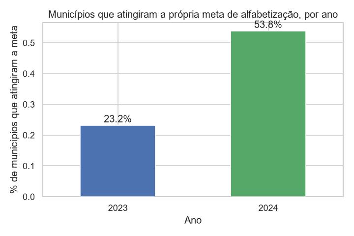
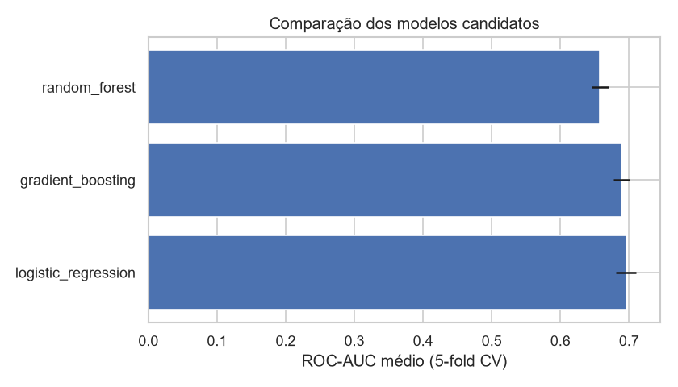
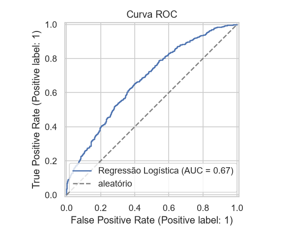
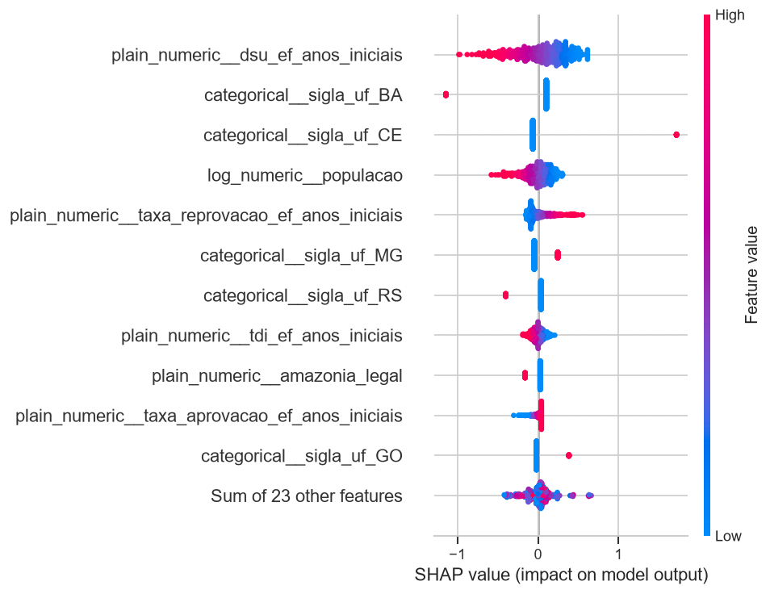
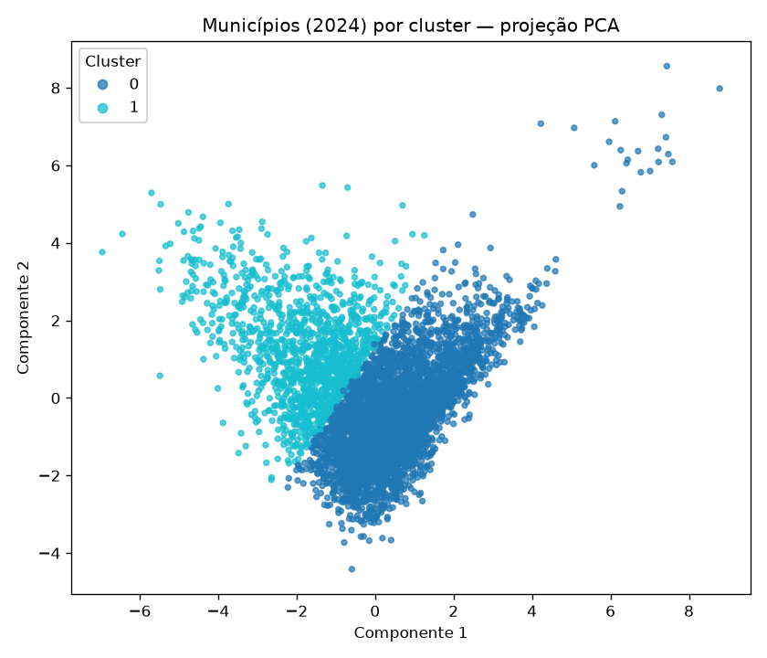
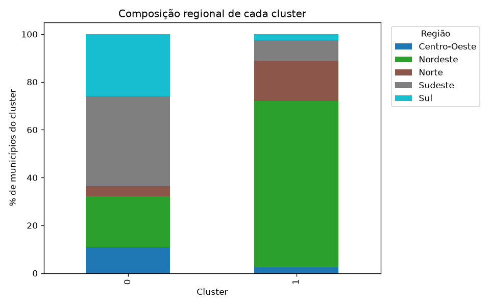
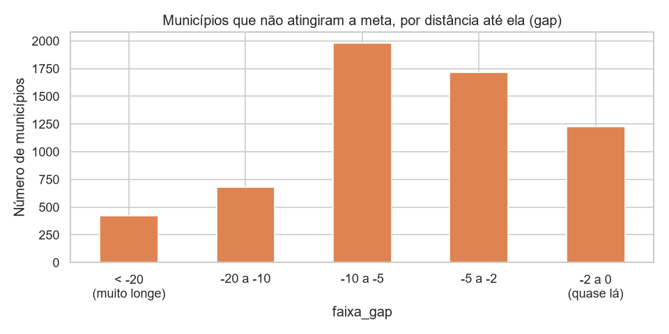

# Tech Challenge – Fase 3: Predição e Inteligência Analítica para Alfabetização no Brasil

Modelo supervisionado de classificação binária que prevê se um município brasileiro atinge ou
não a própria meta oficial de alfabetização (INEP), a partir de dados educacionais, territoriais,
populacionais e socioeconômicos.

Este README é um guia de apresentação do projeto: contexto, principais conclusões e como executar.
O desenvolvimento completo — código, gráficos, hipóteses testadas e decisões passo a passo — está
nos notebooks (`01_eda.ipynb`, `02_modelagem.ipynb`, `03_clustering.ipynb`); os links abaixo
apontam para onde cada resultado foi construído.

## Estrutura do projeto

```
data/               dataset bruto (CSV) e processado (Parquet)
notebooks/          01_eda.ipynb (EDA), 02_modelagem.ipynb (pipeline de ML), 03_clustering.ipynb (K-Means)
src/preprocessing/  extração e junção dos dados (BigQuery)
src/modeling/       pré-processador, modelos candidatos, treino/seleção do campeão, clusterização e ranking de risco
src/evaluation/     métricas de classificação e resumo de validação cruzada
src/visualization/  gráficos usados na EDA e na modelagem
models/             pipeline final treinado e pipeline temporal (só 2023, usado no ranking de risco)
reports/            métricas do modelo campeão e perfil dos clusters (JSON)
images/             gráficos gerados pelos notebooks
```

## Contexto do problema

A alfabetização na idade certa é uma das metas educacionais mais monitoradas no Brasil, com meta
nacional de 100% dos municípios até 2030. Gestores públicos precisam identificar, com antecedência,
quais municípios correm risco de não atingir suas metas, para priorizar recursos e intervenções.

Os dados de alfabetização e metas vêm da camada Silver de um projeto anterior de engenharia de
dados (BigQuery), no grão município × ano, enriquecidos com fontes públicas do IBGE e do INEP.

## Objetivo analítico

Prever, para cada município e ano, se a taxa de alfabetização atinge ou não a meta oficial do
próprio município, e usar o modelo para responder cinco perguntas de negócio: quais fatores mais
impactam a alfabetização, quais municípios estão em maior risco, quais regiões têm padrões
semelhantes, como prever municípios que podem não atingir metas futuras, e quais variáveis mais
pesam na decisão do modelo.

## Escolha da unidade de análise

O enunciado do desafio pede um modelo que preveja se **um aluno** será considerado alfabetizado ou
não. Este projeto reformula o problema para o grão **município × ano**, por três motivos:

- A camada Silver/Gold herdada da Fase 2 não tem nenhuma variável territorial, socioeconômica ou
  populacional no nível do aluno individual — só `rede`, `ano` e `id_municipio`. Modelar no grão
  aluno exigiria microdados individuais (ex.: Censo Escolar por aluno), fora do escopo de dados
  disponível para este desafio.
- É no grão município × ano que existe informação territorial (IBGE), populacional, de PIB e
  educacional complementar suficiente para responder às perguntas de negócio do enunciado — em
  especial "quais municípios apresentam maior risco" e "quais regiões possuem padrões
  semelhantes", que já são formuladas no nível município/região, não aluno.
- O alvo (`atingiu_meta`) usa a mesma meta oficial do INEP por município, preservando a
  interpretação do enunciado ("prever municípios que podem não atingir metas futuras") sem
  inventar um corte artificial de nota individual.

É uma reformulação do problema para aderir aos dados realmente disponíveis, não um desvio do
objetivo: o modelo passa a prever se **um município**, e não um aluno, atinge a própria meta de
alfabetização — mantendo o foco em apoiar decisão de política pública, que é o objetivo central do
desafio.

## Descrição da base utilizada

Unidade de análise: município × ano (ver seção anterior para a justificativa completa).

- **9.921 linhas** (4.689 municípios em 2023 + 5.232 em 2024), 21 colunas.
- **Fontes:** taxa/meta de alfabetização (rede pública) + população (IBGE), PIB (IBGE),
  território/região (IBGE) e indicadores educacionais complementares (INEP), todos unidos por
  `id_municipio`.
- **Alvo (`atingiu_meta`):** `taxa_alfabetizacao >= meta_alfabetizacao_2024`.
- **Vazamento de dado tratado:** `taxa_alfabetizacao`, `media_portugues` e
  `meta_alfabetizacao_2024` ficam no dataset só para referência/reconstrução do alvo — nunca
  entram como features do modelo.

Extração, junção, tratamento de nulos e a lista completa de colunas estão em
`src/preprocessing/extract_data.py` e na primeira metade de `notebooks/01_eda.ipynb`.



## Etapas de modelagem

Extração (BigQuery) → EDA (`01_eda.ipynb`) → pré-processamento com `ColumnTransformer`
(imputação, `log1p`+padronização para população/PIB, one-hot para UF) → comparação de 3 modelos
por validação cruzada → `RandomizedSearchCV` no campeão → validação em holdout estratificado e em
validação temporal (treina 2023, testa 2024) → interpretabilidade (coeficientes + SHAP).

Código completo em `src/modeling/pipeline.py`, `src/modeling/train_model.py` e
`notebooks/02_modelagem.ipynb`.

## Escolha do algoritmo

| Modelo | ROC-AUC médio (CV) |
|---|---|
| **Regressão Logística (campeã)** | **0,6960** (após tuning, `C=0,1`) |
| Gradient Boosting | 0,6891 |
| Random Forest | 0,6575 |

A Regressão Logística venceu a comparação por validação cruzada — resultado que contraria a
expectativa inicial da EDA (que sugeria árvores, pelas correlações lineares fracas), reportado
como está. Detalhes da comparação em `notebooks/02_modelagem.ipynb`.

**Limitação da comparação:** os 3 candidatos foram comparados sem nenhum tuning — só depois de a
Regressão Logística vencer essa comparação inicial (0,6956 sem tuning, já 0,0065 à frente do
Gradient Boosting) é que o `RandomizedSearchCV` foi aplicado, só a ela, subindo o resultado para
0,6960. Não testamos se Gradient Boosting ou Random Forest ganhariam mais que essa margem de
+0,0004 com uma busca de hiperparâmetros equivalente — dada a vantagem já existente antes de
qualquer tuning, é pouco provável que mudasse o resultado, mas essa hipótese não foi verificada.



## Métricas de avaliação

ROC-AUC não depende de qual classe é "positiva", mas precisão/recall dependem — e a pergunta de
negócio é sobre identificar município em **risco** (`atingiu_meta=0`), não sobre acertar quem
atinge a meta. As duas tabelas abaixo reportam a métrica pela classe explícita, para não misturar
as duas:

| Métrica | Holdout (20%) | Validação temporal (2023→2024) |
|---|---|---|
| ROC-AUC | 0,6745 | 0,5535 |
| Acurácia | 0,6408 | 0,4641 |

| Classe risco (`atingiu_meta=0`) | Holdout, threshold 0,5 | Validação temporal, threshold 0,5 |
|---|---|---|
| Precisão | 0,6699 | 0,4589 |
| Recall | 0,8040 | 0,9002 |
| F1 | 0,7308 | 0,6079 |

No threshold padrão (0,5), sem nenhum ajuste, o modelo já identifica 80% dos municípios em risco
no holdout, com 67% de precisão. Testamos subir a precisão escolhendo um threshold por validação
cruzada no treino (nunca no teste, para não vazar a decisão): em P(atingir) ≥ 0,4317, a precisão
sobe para 0,70 ao custo de recall cair para 0,66 — uma troca de recall por precisão, não uma
melhora incondicional. A escolha entre os dois pontos depende de quanto a política pública tolera
falso positivo (visitar um município que não precisava) vs. falso negativo (deixar passar um que
precisava); ver `notebooks/02_modelagem.ipynb` para os dois pontos completos.

Na validação temporal (treina 2023, testa 2024), a classe risco mantém recall alto (0,90) mesmo
fora da amostra — o modelo continua sinalizando quase todos os municípios que de fato não batem a
meta — mas a precisão cai para 0,46: ele passa a marcar município demais como risco. Discutido em
"Limitações". Curvas e matriz de confusão em `notebooks/02_modelagem.ipynb`.



## Interpretação dos resultados

Coeficientes e SHAP convergem: o **sinal mais forte é geográfico** (Bahia, Sergipe e Tocantins
negativos; Ceará fortemente positivo). Fora da geografia, `dsu_ef_anos_iniciais` (% de docentes
com curso superior) é a variável de maior impacto médio, com efeito negativo — um padrão
contraintuitivo, consistente nas 5 regiões do país, sem explicação causal identificada até agora.



## Municípios de maior risco

Aplicando ao snapshot de 2024 completo o pipeline treinado **só com 2023** (`models/pipeline_temporal_2023.joblib`,
via `src/modeling/predict_risk.py`, ranking completo em `reports/ranking_risco_municipios.csv`) —
não o modelo campeão, que foi treinado num split que mistura 2023+2024 e já teria visto boa parte
do snapshot — **90% dos 20 municípios com menor probabilidade prevista de atingir a meta de fato
não a atingiram**, numa previsão genuinamente fora da amostra. A lista expõe uma limitação direta
do modelo: por o coeficiente de UF dominar a previsão, **15 dos 20 primeiros colocados são da
Bahia**; os demais são capitais de outros estados (Rio de Janeiro, Belém, Palmas), incluindo 2
falsos positivos (municípios que na verdade atingiram a meta) — coerente com a queda de precisão
já vista na validação temporal. O ranking hoje funciona melhor como filtro estadual do que como
diagnóstico fino por município. Discussão completa em `notebooks/02_modelagem.ipynb`.

## Regiões com padrões semelhantes (clusterização)

Além do modelo supervisionado, os municípios de 2024 foram agrupados por perfil territorial,
populacional, socioeconômico e educacional (K-Means, sem usar UF/região como feature de
agrupamento, só para caracterizar os grupos depois de formados). O melhor agrupamento (silhouette
score) foi **k=2**:

| Cluster | Municípios | % atingiu meta | Taxa de alfabetização média | Composição regional dominante | `dsu_ef_anos_iniciais` médio |
|---|---|---|---|---|---|
| 0 | 3.931 (75%) | 56,1% | 66,4% | Sudeste (38%), Sul (26%), Nordeste (21%) | 15,4% |
| 1 | 1.301 (25%) | 47,1% | 54,9% | Nordeste (69%), Norte (17%), 31% Amazônia Legal | 27,5% |

Os dois grupos têm desfecho de alfabetização bem diferente, mas o cluster 1 (pior desfecho) tem
quase o dobro do percentual de docentes com curso superior do cluster 0 — o mesmo padrão
contraintuitivo já visto na interpretação do modelo supervisionado, agora associado a um perfil
regional inteiro (Nordeste/Norte/Amazônia Legal), não a uma variável isolada. Os silhouette scores
foram modestos em todos os k testados (0,16-0,23), indicando um contínuo de perfis municipais em
vez de fronteiras rígidas. Desenvolvimento completo em `notebooks/03_clustering.ipynb` e
`src/modeling/clustering.py`.




## Insights encontrados

- A melhora de 2023 para 2024 (23,2% → 53,8% de municípios na meta) é uma melhora real na taxa de
  alfabetização, não uma meta mais fácil de bater.
- O Sul foi a única região que piorou (RS caiu para 8,3% de municípios na meta em 2024, ante 53,8%
  nacional) — coincide no tempo com as enchentes de abril-maio de 2024 no estado, hipótese
  plausível mas não comprovável com as variáveis disponíveis.
- População e PIB são fortemente correlacionados entre si (0,95) e quase não têm correlação
  individual com o alvo.
- Dos 6.018 municípios que não atingiram a meta em 2024, 1.225 (20,4%) estavam a menos de 2 pontos
  percentuais dela.

Análise completa, incluindo hipóteses testadas e não confirmadas, em `notebooks/01_eda.ipynb`.

## Limitações do projeto

- Dataset pequeno para o grão escolhido: apenas 2 anos (2023-2024).
- Validação temporal (treina 2023, testa 2024) mostra ROC-AUC caindo para 0,55 — a classe risco
  mantém recall alto (0,90) fora da amostra, mas a precisão cai para 0,46: o modelo passa a
  alarmar município demais, não a deixar de sinalizar quem precisa. Serve para ranquear risco
  relativo dentro do mesmo ciclo de avaliação, não para prever o patamar nacional de um ano futuro
  sem recalibração.
- PIB de 2024 usa 2023 como proxy (defasagem normal da fonte).
- Possível choque exógeno no RS (enchentes de 2024) não capturado por nenhuma variável do dataset.
- A clusterização teve silhouette scores modestos (0,16-0,23) em todos os valores de k testados —
  os dois grupos encontrados são uma tendência real, não uma fronteira rígida entre perfis de
  município.
- O ranking de municípios de maior risco (fora da amostra, modelo treinado só em 2023) acerta 90%
  no Top 20, mas 15 dessa lista ainda saem de um único estado (Bahia) e 2 dos demais são falsos
  positivos — reflexo do peso de UF na previsão, não um diagnóstico fino que diferencie municípios
  dentro do mesmo estado.

## Aplicação prática para políticas públicas

- Usado como ferramenta de triagem no threshold padrão, o modelo já identifica 80% dos municípios
  que de fato não atingirão a meta (20% de falso positivo) — adequado para priorizar visitas
  técnicas e recursos. Um threshold mais conservador (P(atingir) ≥ 0,4317) troca recall por
  precisão (66% de recall, 70% de precisão), se a política preferir menos falsos alarmes. O
  ranking completo por probabilidade prevista está em `reports/ranking_risco_municipios.csv`.
- Peso forte de UF permite priorização geográfica objetiva (ex.: acompanhamento reforçado em
  Bahia, Sergipe e Tocantins), mas não substitui um diagnóstico município a município dentro do
  mesmo estado.
- O grupo de 1.225 municípios a menos de 2 pontos da própria meta é um alvo natural para
  intervenções pontuais de curto prazo e baixo custo.
- O modelo deve ser recalibrado a cada novo ciclo de avaliação, dado o salto real de patamar
  observado entre 2023 e 2024.



## Possíveis evoluções futuras

- Treinar um modelo por UF (ou incluir interações UF × features municipais) para que o ranking de
  risco diferencie municípios dentro do mesmo estado, em vez de ser dominado pelo efeito estadual.
- Investigar a causa do perfil regional Nordeste/Norte/Amazônia Legal ter pior desfecho de
  alfabetização apesar de maior percentual de docentes com curso superior (achado da
  clusterização).
- Investigar a hipótese das enchentes no RS com uma fonte externa de eventos climáticos.
- Ampliar a série histórica conforme novos ciclos do INEP forem publicados.
- Investigar a causa da relação negativa entre `dsu_ef_anos_iniciais` e o alvo.
- Reavaliar a necessidade de manter população e PIB simultaneamente, dada a multicolinearidade.

## Como reproduzir

```cmd
python -m venv .venv
.venv\Scripts\activate
pip install -r requirements.txt

python src/preprocessing/extract_data.py
python src/modeling/train_model.py
python src/modeling/clustering.py
python src/modeling/predict_risk.py
```

A extração requer `gcloud auth login` já configurado com acesso de leitura ao projeto BigQuery de
origem dos dados e às tabelas públicas do Base dos Dados. Os notebooks podem ser reexecutados a
partir de `data/processed/*.parquet`, sem credenciais, desde que a extração já tenha rodado uma
vez.
